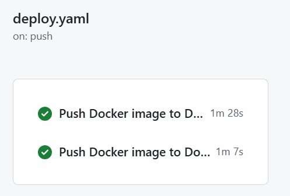

# Docker-контейнеризация и хранение данных

1. По результатам работы образы собираются без ошибок:

2. Используется легковесный базовы образы alpine: 
- golang:1.21-alpine 
- alpine:latest
- node:18-alpine (для фронта)
3. Создан .dockerignore для исключения ненужных файлов при сборке.
4. Оптимизирован порядок инструкций в Dockerfile для эффективного кэширования.
5. Настроены healthchecks для проверки работоспособности контейнеров.
6. Настроены зависимости между сервисами, volumes, ограничения ресурсов.
7. Исключена чувствительная информация из образов.